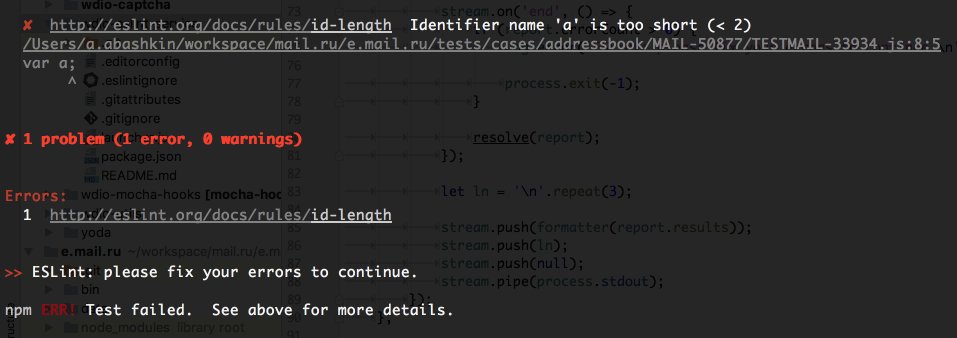

# wdio-eslint-service

> A WDIO service for ESLint 




### Installation

```
npm install wdio-eslint-service --save
```

### Usage

#### wdio.config.js

```js
{
	services: [
		'eslint'
	],

	eslintOptions: {
		files: ['**/*.js']
	}
}
```


#### Options

##### Custom options

* **cache** — Only check changed files. In additional, we see your diff (for Git repositories).
* **files** — This option allows you to specify which files will be used.

##### Standard options

* **extensions** — Specify JavaScript / Typescript file extensions. Default: `.js`.
* **format** — Use a specific output format. Default: `node_modules/eslint-friendly-formatter`

In additional you can use all [options and rules](http://eslint.org/docs/developer-guide/nodejs-api) are available in ESLint. 


#### TypeScript

Make sure you already have the following dependencies: 

**package.json**

```json
{
	"typescript": "^2.1.5",
	"eslint-plugin-typescript": "^0.1.0",
	"typescript-eslint-parser": "^1.0.3"
}
```

**wdio.config.js**

```js
{
    services: [
        'eslint'
    ],

	eslintOptions: {
		extensions: ['.js', '.ts']
	}
}
```

**eslintrc.js**

```js
{
	parser: 'typescript-eslint-parser',
	plugins: [ 'typescript' ],
	parserOptions: {
		sourceType: 'module',
		ecmaFeatures: {
			impliedStrict: true
		}
	}
}
```

These options can be added to `wdio.config.js` as well.


### Rationale

#### Before:

**package.json**

```json
{
	"scripts": {
		"test": "wdio wdio.conf.js",
		"lint": "eslint . --cache --format node_modules/eslint-friendly-formatter --ext .js"
	},

	"pre-commit": {
		"silent": true,

		"run": [
			"lint"
		]
	}
}
```

Or:

```json
{
	"scripts": {
		"test": "eslint . --cache --format node_modules/eslint-friendly-formatter --ext .js && wdio wdio.conf.js"
	}
}
```

What if you want to run your ESLint task only locally? In this case, you should care about some environment variables on your server:

**CI**

```sh
SERVER_SIDE_ENV=npm test
```

**utils/test.sh**

```sh
#!/usr/bin/env bash

if [ -z $SERVER_SIDE_ENV ]
	then  eslint . --cache --format node_modules/eslint-friendly-formatter --ext .js
fi

wdio wdio.conf.js
```

```json
{
	 "scripts": {
		"test": "source ./utils/test.sh"
	}
}
```

Do you like it? I don't think so.


#### After

**.gitignore**

```sh
wdio.conf.local.js
```

**package.json**

```json
{
	"scripts": {
		"test": "test wdio.conf.local.js && wdio wdio.conf.local.js || wdio wdio.conf.js"
	}
}
```

**wdio.conf.local.js**

```js
{
    services: [
        'eslint'
    ],
 
    eslintOptions: {
        files: ['**/*.js']
    }
}
```

So, you can have several configuration files for different environments and preferences.< br />
That's why `wdio-eslint-service` is so actual.


### License

MIT

